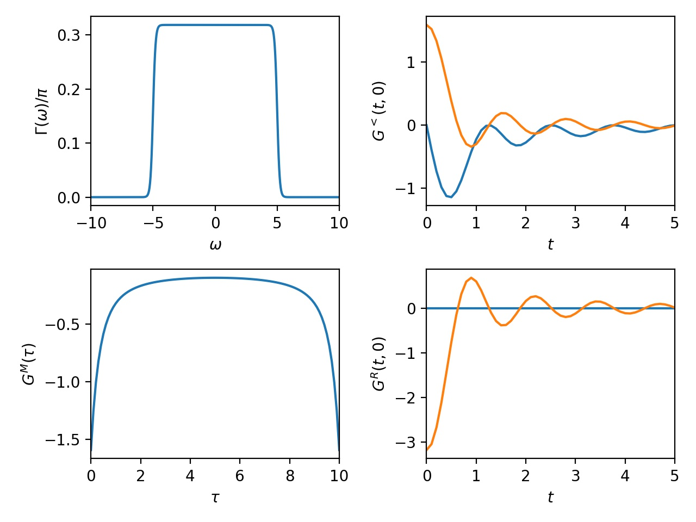

# Keldysh.jl

[](https://github.com/kleinhenz/Keldysh.jl/actions)

`Keldysh.jl` provides a set of tools for working with non-equilibrium Keldysh Green's functions.
It contains types to represent contours, grids defined on these contours, and two-time Green's functions defined on these grids.
Additionally, it provides functions for generating Green's functions, performing integration on a contour and hdf5 serialization.


Credit to Andrey Antipov and Igor Krivenko for designing a first version of the abstractions implemented here.

## Usage

The following code constructs a Green's function object from a spectral density and plots the Matsubara, retarded, and lesser Keldysh components.
```Julia
using Keldysh, PyPlot

# first define a contour
tmax = 5.0
β = 10.0
c = FullContour(; tmax, β)

# now define a grid which represents a discretization of the contour
nt = 51
ntau = 101
grid = FullTimeGrid(c, nt, ntau)

# construct a spectral density
dos = flat_dos(; D=5.0, ν=10.0)

# construct a Green's function from a spectral density
G = FullTimeGF(dos, grid)

fig, axes = plt.subplots(nrows=2, ncols=2)
make_plot = (ax, xlabel, ylabel, t, f...) -> begin
  map(fi -> ax.plot(t, fi), f)
  ax.set_xlabel(xlabel); ax.set_ylabel(ylabel)
end

ω = range(-10.0, 10.0, length=1001)
t = realtimes(grid)
τ = imagtimes(grid)

make_plot(axes[1], L"ω", L"Γ(ω)/π", ω, dos.(ω))
make_plot(axes[2], L"τ", L"G^M(τ)", τ, G[:matsubara])
make_plot(axes[3], L"t", L"G^<(t, 0)", t, real(G[:lesser][:,1]), imag(G[:lesser][:,1]))
make_plot(axes[4], L"t", L"G^R(t, 0)", t, real(G[:retarded][:,1]), imag(G[:retarded][:,1]))

fig.tight_layout()
fig.savefig("keldysh_components.jpg", dpi=200)
```
This produces the following output:


See also [anderson_nca.jl](doc/examples/anderson_nca.jl) which implements a NCA solver for the anderson impurity model using `Keldysh.jl`.
